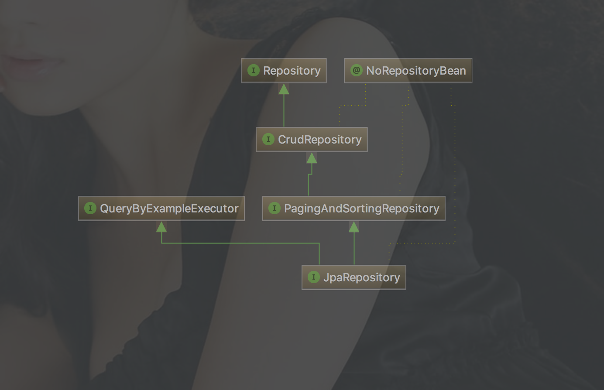
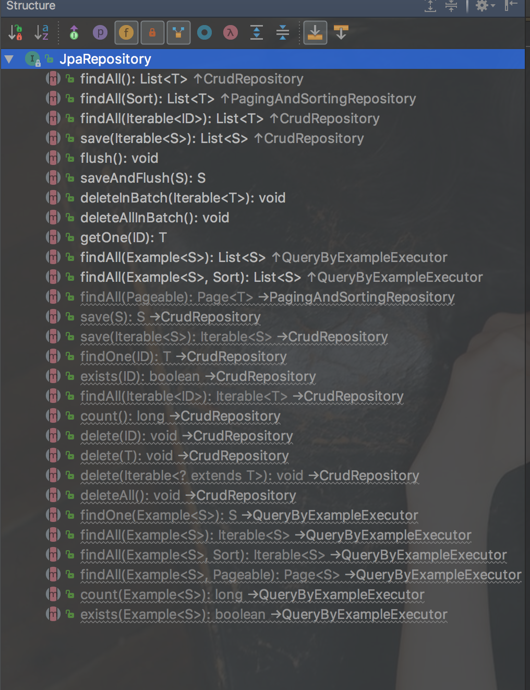

完整代码示例，请参考个人GitHub仓库:[kingboy-springboot-data](https://github.com/KingBoyWorld/kingboy-springboot-data/tree/feature_jpa_hibernate),
包含controller/repository以及测试代码。

欢迎star，如有错误，欢迎指正^_^

### 一、SpringBoot集成Hibernate JPA的依赖

```gradle
    compile(
            //hibernate
            'org.springframework.boot:spring-boot-starter-data-jpa',
            'org.hibernate:hibernate-java8',
            'mysql:mysql-connector-java',
            //springmvc
            'org.springframework.boot:spring-boot-starter-web',
            "com.fasterxml.jackson.datatype:jackson-datatype-jsr310",
            "com.kingboy:common:$commonVersion"
    )
```

### 二、环境准备

1.配置文件
```
server:
  port: 8080

spring:
  application:
    name: kingboy-springboot-data
  datasource:
    driver-class-name: com.mysql.jdbc.Driver
    url: jdbc:mysql:///jpa?useUnicode=true&characterEncoding=utf-8&useSSL=false
    username: root
    password: 123456
    schema: classpath:shema.sql
    data: classpath:data.sql
  jpa:
    hibernate:
      ddl-auto: none
```
2.创建data.sql和schema.sql

scheme.sql：建表语句，我没有使用hibernate的建表

```sql
CREATE TABLE IF NOT EXISTS `user` (
  `id` bigint(20) NOT NULL,
  `age` int(11) DEFAULT NULL,
  `birth` datetime DEFAULT NULL,
  `password` varchar(255) COLLATE utf8_unicode_ci DEFAULT NULL,
  `realname` varchar(255) COLLATE utf8_unicode_ci DEFAULT NULL,
  `username` varchar(255) COLLATE utf8_unicode_ci DEFAULT NULL,
  PRIMARY KEY (`id`)
) ENGINE=InnoDB DEFAULT CHARSET=utf8 COLLATE=utf8_unicode_ci;
```


data.sql：一些假数据，每次重启清空重新插入

```sql
DELETE FROM `user`;

INSERT INTO `user`
VALUES
        ('1', '56', '2016-09-12 12:12:00', 'king123', '小明', 'boy'),
        ('2', '12', '1993-08-12 07:12:00', 'king123', '小南', 'kingboy'),
        ('3', '11', '1992-05-12 23:12:00', 'king123', '小孩', 'boyking'),
        ('4', '2', '2006-12-13 20:12:00', 'king123', '金子', 'kiboy'),
        ('5', '66', '2012-09-12 05:12:00', 'king123', '哈喽小金', 'baby'),
        ('6', '12', '2000-02-13 06:12:00', 'king123', 'Baby', 'xiaohong'),
        ('7', '24', '2017-12-12 11:12:00', 'king123', '小金', 'king');
```

### 三、实体类

```java
@Entity
public class User {

    @Id
    private Long id;

    private String username;

    private String realname;

    private String password;

    private Integer age;

    @JsonFormat(pattern = "yyyy-MM-dd HH:mm")
    private LocalDateTime birth;
    
    //Setter Getter ...

}
```

### 四、编写仓库

#### 1.代码编写
写一个类继承JpaRepository<T, ID>，需要写两个泛型，第一个代表要存储的实体类型，第二个代表主键类型，例如写一个User类的仓储如下：

```java
public interface UserRepository extends JpaRepository<User, Long> {
    
}
```

我们来看一下JpaRepository的继承结构(如下)，其实就可以发现仍然是JPA的一套Reposiroty，那我们其实就可以用JPA的一套接口操作进行数据的增删改查，
spring会自动根据方法名为我们生成对应的代理类去实现这些方法。

>>>> 


#### 2.CRUD基础操作

先来看看JpaRepository已经实现的一些基础方法，这些方法的名称已经具有很好的说明解释了，那么大家自己看看，很容易就能理解

>>>> 


#### 3.稍微复杂操作

jpa自带的这些方法肯定是不能满足我们的业务需求的，那么我们如何自定义方法呢？我们只要使用特定的单词对方法名进行定义，那么Spring就会对我们写的方法名进行解析，
生成对应的实例进行数据处理，有木有很简单？那么接下来就使用Spring官方文档中的实例进行演示。

先来看下官方关键字的说明

|逻辑操作|在定义方法时使用的关键词|
|--|--|
|AND | And|
|OR | Or|
|AFTER  | After , IsAfter|
|BEFORE | Before , IsBefore|
|CONTAINING | Containing , IsContaining , Contains|
|BETWEEN | Between , IsBetween|
|ENDING_WITH | EndingWith , IsEndingWith , EndsWith|
|EXISTS | Exists|
|FALSE | False , IsFalse|
|GREATER_THAN | GreaterThan , IsGreaterThan|
|GREATER_THAN_EQUALS | GreaterThanEqual , IsGreaterThanEqual|
|IN | In , IsIn|
|IS | Is , Equals , (or no keyword)|
|IS_EMPTY | IsEmpty , Empty|
|IS_NOT_EMPTY | IsNotEmpty , NotEmpty|
|IS_NOT_NULL | NotNull , IsNotNull|
|IS_NULL | Null , IsNull|
|LESS_THAN | LessThan , IsLessThan|
|LESS_THAN_EQUAL | LessThanEqual , IsLessThanEqual|
|LIKE | Like , IsLike|
|NEAR | Near , IsNear|
|NOT | Not , IsNot|
|NOT_IN | NotIn , IsNotIn|
|NOT_LIKE | NotLike , IsNotLike|
|REGEX | Regex , MatchesRegex , Matches|
|STARTING_WITH | StartingWith , IsStartingWith , StartsWith|
|TRUE | True , IsTrue|
|WITHIN | Within , IsWithin|

举几个方法的栗子：

|使用示例                 |说明               |
|------------------------|---------------------------|
|findByNameAndPrice(String name,Double price)      |根据用户名和价格进行查询|
|findByNameOrPrice(String name,Double price)       |根据用户名或者价格进行查询|
|findByName(String name)   |根据用户名进行查找|
|findByNameNot(String name) |查找用户名!=name的用户|
|findByPriceBetween(Double a, Double b)|查询价格区间|
|findByPriceLessThan(Double price)|查询价格小于price,不包含price|
|findByPriceGreaterThan(Double price)|查询价格大于price,不包含price|
|findByPriceBefore(Double price)|查询价格小于price,包含price|
|findByPriceAfterDouble price|查询价格大于price,包含price|
|findByNameLike(String name)|根据用户名查询？？？？？？这个我实验了下，是完全匹配查询，并没有模糊查询|
|findByNameStartingWith(String name)|用户名以name开头的用户|
|findByNameEndingWith(String name)|用户名以name结尾的用户|
|findByNameContaining(String name)|用户名包含name的用户，相当于sql中的like %name%|
|findByNameIn(Collection<String>names)|查询用户名在名称列表的用户|
|findByNameNotIn(Collection<String>names) |查询用户名不在名称列表的用户|
|findByAvailableTrue|查询avaliable属性为true的用户|
|findByAvailableFalse|查询avaliable属性为false的用户|
|findByAvailableTrueOrderByNameDesc()|查询avaliable属性为true的用户，并按用户名排序|


> 如果需要分页功能的话，只需要在方法的最后一个参数加上Pageable就可以了，下面的示例中有演示

下面写几个示例进行演示，只把仓储层的列出来了，整体运行是测试过的，没问题，如果需要整体代码请到本文顶部的github仓库查看。

```java
public interface UserRepository extends JpaRepository<User, Long> {

    /**
     * 查询用户名为username的用户
     * @param username
     * @return
     */
    List<User> findByUsername(String username);
    
    /**
     * 查询用户名为username的用户,带分页
     * @param username
     * @return
     */
    List<User> findByUsername(String username, Pageable pageable);

    /**
     * 查询用户名为username并且真实姓名为realname的用户
     * @param username
     * @param realname
     */
    List<User> findByUsernameAndRealname(String username, String realname);

    /**
     * 查询用户名为username或者姓名为realname的用户
     */
    List<User> findByUsernameOrRealname(String username, String realname);

    /**
     * 查询用户名不是username的所有用户
     * @param username
     * @return
     */
    List<User> findByUsernameNot(String username);


    /**
     * 查询年龄段为ageFrom到ageTo的用户
     * @param ageFrom
     * @param ageTo
     * @return
     */
    List<User> findByAgeBetween(Integer ageFrom, Integer ageTo);

    /**
     * 查询生日小于birthTo的用户
     */
    List<User> findByBirthLessThan(LocalDateTime birthTo);


    /**
     * 查询生日段大于birthFrom的用户
     * @param birthFrom
     * @return
     */
    List<User> findByBirthGreaterThan(LocalDateTime birthFrom);

    /**
     * 查询年龄小于或等于ageTo的用户
     */
    List<User> findByAgeBefore(Integer ageTo);

    /**
     * 查询年龄大于或等于ageFrom的用户
     * @param ageFrom
     * @return
     */
    List<User> findByAgeAfter(Integer ageFrom);

    /**
     * 用户名模糊查询
     * @param username
     * @return
     */
    List<User> findByUsernameLike(String username);


    /**
     * 查询以start开头的用户
     * @param start
     * @return
     */
    List<User> findByUsernameStartingWith(String start);

    /**
     * 查询以end结尾的用户
     * @return
     */
    List<User> findByUsernameEndingWith(String end);

    /**
     * 查询用户名包含word的用户
     * @param word
     * @return
     */
    List<User> findByUsernameContaining(String word);

    /**
     * 查询名字属于usernames中的用户
     * @param usernames
     * @return
     */
    List<User> findByUsernameIn(Collection<String> usernames);

    /**
     * 查询名字不属于usernames中的用户
     * @param usernames
     * @return
     */
    List<User> findByUsernameNotIn(Collection<String> usernames);

    /**
     *最后来个复杂点的：查询年龄小于ageTo,姓名以start开头，id大于idTo的用户，并且按照年龄倒序
     * @return
     */
    List<User> findByAgeBeforeAndUsernameStartingWithAndIdGreaterThanOrderByAgeDesc(Integer ageTo, String start, Long idTo);

}
```


#### 4.更复杂一点的操作

我们可以使用@Query注解进行查询，这样要求我们自己写查询语句，需要会hqlS查询才可以，其实也很简单，不会写查就是了。

> 注意：hql的方式仍然可以在参数最后一个加Pageable进行分页，但是nativeQuery不可以。

```java
public interface BookRepository extends ElasticsearchRepository<Book, String> {
       /**
        * 使用@Query和hql进行查询
        * @param name
        * @return
        */
       @Query("from User where username = :name")
       List<User> findByNameHQL(@Param(value = "name") String name, Pageable pageable);
   
       /**
        * 使用原生sql进行查询
        * @param name
        * @return
        */
       @Query(value = "select * from user where username = :name", nativeQuery = true)
       List<User> findByNameNative(@Param(value = "name") String name);
}
```

#### 5.这种通过接口方法的方式也可以进行联表查询，以后有机会再补充